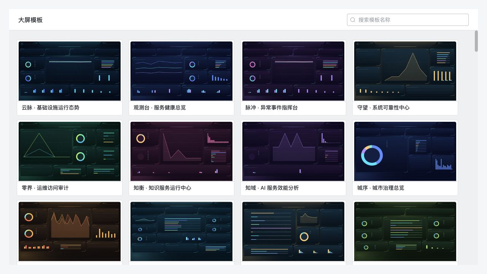
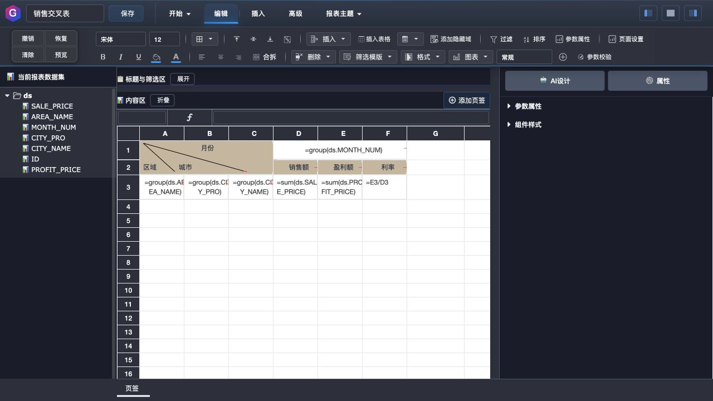
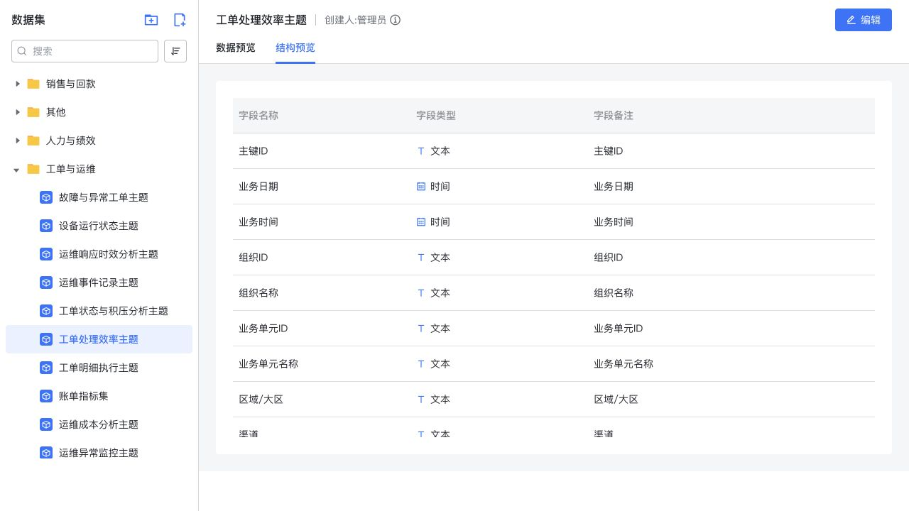

# 格灵数据平台

### 把复杂业务做成报表，把关键指标呈现在大屏

**企业报表 × 可视化大屏 × 统一数据管理**

**开放免费使用 · 支持自行部署 · 浏览器在线设计**

## [免费下载与安装](下载安装.md)

[产品体验](https://www.goddesses.net.cn/geling/console/access/landing) · [文档中心](https://www.goddesses.net.cn/geling/introduction/#/) · [下载安装](下载安装.md) · [部署说明](INSTALL.md) · [联系微信：glradmin](#获取平台与交流)

**格灵数据平台，将专业报表和可视化大屏放进同一套数据应用工作流。** 从数据库、文件或 API 接入数据，整理可复用的数据集，再用两种设计器完成明细查询、交叉统计、经营分析和大屏展示，让数据从“查得到”走向“看得清、用得上”。

面向企业内部数据应用、业务系统配套分析、项目实施与运营展示。财务需要的规范表格、业务需要的查询明细、管理者需要的指标总览，可以在同一平台中建设和维护。

> **格灵数据平台开放免费使用。** 欢迎实际体验，也欢迎带着具体场景交流。本仓库提供产品介绍、系统实景与安装使用资料；安装包获取方式与发布状态见[下载安装](下载安装.md)。

## 为什么选择格灵

| 核心能力 | 对实际工作的价值 |
| :--- | :--- |
| **两种专业设计器** | 报表处理复杂表格结构，大屏组织指标、趋势与分布，各自匹配业务表达方式。 |
| **同一份数据，多种表达** | 数据集可用于报表和大屏，复用查询与字段定义，减少两套页面反复准备数据的工作。 |
| **复杂报表可视化设计** | 在类 Excel 界面中配置分组、扩展、公式、过滤和交叉统计，兼顾数据分析与规范化输出。 |
| **大屏可编辑、可交互** | 组件绑定数据后由后台查询驱动，配置刷新与联动，让展示页面用于持续查看业务。 |
| **125 套大屏模板** | 复用行业主题、画布布局与组件样式，再根据企业品牌和指标体系继续设计。 |
| **作品与权限集中管理** | 从统一工作台管理数据、报表、大屏、模板、用户与角色，便于团队分工和持续维护。 |

## 格灵报表：复杂结构，也能清晰表达

**明细表、分组汇总、交叉统计、图表组合，围绕业务口径组织报表。**

在类 Excel 的在线设计器中，设计人员可以控制单元格、行列扩展、公式和格式。既能制作按条件查询的业务明细，也能组织区域 × 月份、产品 × 渠道等多维交叉分析。

*销售交叉表设计实景：通过区域、城市、月份分组，组织销售额、利润额与利润率。*

- **结构设计**：单元格合并、分组扩展、表头布局和多页签内容组织，适配常见业务表格。
- **计算分析**：公式与聚合计算配合使用，将金额、数量、比率等指标放进同一份报表。
- **条件查询**：配置时间、区域、组织等参数与过滤条件，让同一设计服务不同查询需求。
- **成果输出**：在线预览、导出与打印，衔接日常查询、业务核对、例会汇报和归档。
- **辅助设计**：提供 AI 辅助报表设计入口；接入模型服务后使用，生成结果可继续编辑和核对。

[查看报表制作教程](https://www.goddesses.net.cn/geling/introduction/#/快速入门/制作报表)

## 格灵大屏：从视觉表现，到数据交互

**自由画布组织全局视图，数据驱动每一个图表。**

将指标卡、趋势图、结构分布、排名和明细列表组合在同一画面，适用于运营中心、业务总览、会议展示及项目演示。布局、标题、配色与背景可以持续调整，形成符合企业风格的可视化界面。

| 设计环节 | 可用能力 |
| :--- | :--- |
| 画布编排 | 图层、组件位置与尺寸、文本、图片、背景与样式设置 |
| 数据绑定 | 选择数据集，配置维度、指标、聚合方式与过滤条件 |
| 交互分析 | 按组件能力配置查询、联动、下钻和跳转 |
| 持续展示 | 配置数据刷新，预览验证，保存并发布作品 |
| 模板再设计 | 应用模板后继续修改标题、布局、组件与数据绑定 |

模板缩略图用于选型；进入大屏后呈现的是图表组件和数据结果，可继续设计、配置与发布。

[查看大屏设计与发布文档](https://www.goddesses.net.cn/geling/introduction/#/大屏使用/制作第一个大屏)

## 模板资源：让设计成果持续复用

当前大屏模板库包含 **125 套模板**，覆盖基础设施、城市治理、制造、零售、物流、园区等主题。报表模板则提供查询、汇总与业务统计的结构参考。

**选择模板 → 预览效果 → 应用到设计器 → 绑定业务数据 → 调整并发布。**

模板既提供视觉起点，也保留继续设计的空间。企业可以围绕品牌规范、业务指标和展示分辨率形成自己的作品库。模板中的示例数据在实际使用时替换为业务数据集，并核对字段与统计口径。

## 统一数据管理：一次整理，服务多种分析

**先把数据和口径整理清楚，再决定怎样展示。**

数据源负责连接业务数据；数据集负责整理查询、字段和关联关系；报表与大屏负责统计和呈现。数据准备与作品设计可以由不同人员协作完成。

- 接入数据库、文件或接口数据，按业务需要维护连接与查询。
- 使用表关联或自定义 SQL 组织数据集，查看字段结构与预览结果。
- 管理维度、指标与字段定义，让设计人员基于数据集制作报表和大屏。
- 按销售、财务、供应链、工单等主题积累数据与作品，减少重复配置。

例如，同一销售数据集可以支撑区域销售交叉表、产品销售排名和经营趋势大屏。统一时间范围、筛选条件与聚合规则后，团队可以从总览回到明细，核对同一个业务问题。

[查看数据管理文档](https://www.goddesses.net.cn/geling/introduction/#/数据管理/创建与编辑数据集) · [报表与大屏联合分析案例](https://www.goddesses.net.cn/geling/introduction/#/业务案例/报表与大屏联合分析)

## 统一工作台：把数据应用组织起来

通过统一导航组织数据管理、两种设计器、作品与模板资源，使数据准备、设计和使用衔接在同一入口。

| 工作入口 | 主要用途 |
| :--- | :--- |
| 新建 | 开始制作报表或大屏 |
| 数据管理 | 维护数据源、数据集与字段 |
| 我的报表 / 我的大屏 | 查找、编辑、预览和维护已有作品 |
| 报表模板 / 大屏模板 | 选择并复用已有设计 |
| 系统管理 | 管理用户、角色、组织及功能和数据访问配置 |

业务人员使用查询和展示页面，设计人员维护作品，数据管理员维护连接与字段，系统管理员组织账号和授权。各项能力在同一入口下衔接，适合从单一业务主题逐步扩展到多部门数据应用。

## 可以落地在哪些场景

| 业务场景 | 报表侧：展开与核对 | 大屏侧：总览与展示 |
| :--- | :--- | :--- |
| **经营与销售** | 销售明细、区域交叉统计、回款汇总 | 经营指标、销售趋势、区域分布 |
| **财务与费用** | 收支统计、费用汇总、应收分析 | 费用结构、资金变化、财务指标 |
| **供应链与库存** | 库存明细、出入库统计、采购分析 | 库存分布、供销趋势、履约指标 |
| **工单与运维** | 工单汇总、处理效率、设备状态统计 | 运行态势、资源分布、服务指标 |
| **业务系统配套** | 在现有系统中嵌入查询与分析页面 | 面向业务场景集中呈现可视化结果 |

这些场景通过数据集与作品配置实现。文档中心提供销售、工单案例及可核对的示例数据，方便理解从数据准备到成果展示的完整过程。

## 安装与文档

**支持在自己的环境中部署，报表与大屏通过浏览器访问。**

[安装与获取说明](INSTALL.md)涵盖包的组成、运行环境和部署验收入口。完整文档包含产品介绍、角色学习路径、报表设计、大屏制作、数据管理、系统权限、部署运维及集成示例。

| 你想完成的工作 | 文档入口 |
| :--- | :--- |
| 了解功能与产品分工 | [产品简介](https://www.goddesses.net.cn/geling/introduction/#/产品概述/产品简介) |
| 按自己的角色开始使用 | [学习路径](https://www.goddesses.net.cn/geling/introduction/#/快速入门/按角色选择学习路径) |
| 制作销售分析报表 | [销售分析案例](https://www.goddesses.net.cn/geling/introduction/#/业务案例/销售分析报表) |
| 制作工单分析大屏 | [工单大屏案例](https://www.goddesses.net.cn/geling/introduction/#/业务案例/工单分析大屏) |
| 安装、配置与检查 | [部署文档](https://www.goddesses.net.cn/geling/introduction/#/安装部署新版/部署架构与目录) |
| 将成果接入已有系统 | [系统集成](https://www.goddesses.net.cn/geling/introduction/#/系统集成/报表集成) |

## 获取平台与交流

**格灵数据平台开放免费使用，欢迎实际体验，也欢迎带着具体场景交流。**

如需了解平台功能、安装包、使用方式，或交流企业报表与数据大屏的应用需求，欢迎联系。

### 微信：`glradmin`

联系时可以说明目标场景，以及需要报表、大屏还是完整平台；获取安装包时附上操作系统和数据库环境，便于匹配交付资料。

[进入产品](https://www.goddesses.net.cn/geling/console/access/landing) · [阅读文档](https://www.goddesses.net.cn/geling/introduction/#/) · [反馈使用问题](https://github.com/dengbp/geling-data-platform/issues)

---

截图为实际系统页面，展示演示数据或模板示例数据。模板数量核对于 2026-09-11，具体组件及依赖以交付版本为准。本仓库不包含应用源码；免费使用与开源授权是不同概念，安装包及第三方组件的适用条款以随包说明和实际授权为准。
